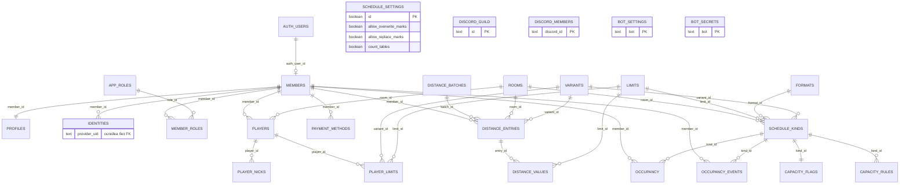

# База schedule-app

Одна база: **Postgres в Supabase** (проект `wvfllegshaqonqqpbtle`, EU). Не несколько баз — несколько таблиц в одной. Discord — внешний сервис, не наша таблица. Вход (`auth.users`) — схема Auth **того же** проекта.

Сверку живой схемы делали **22 сентября 2026**. Интерактивная схема с перетаскиванием таблиц — Canvas «Схема базы» рядом с чатом в Cursor. SQL: [`../supabase/migrations`](../supabase/migrations). Сид справочников: [`../supabase/seed.sql`](../supabase/seed.sql). Смысл сущностей: [модель данных](domain-model.md).

## Где лежит то, что видно на экране

| На экране | Таблица | Ключ |
|---|---|---|
| Человек клуба (карточка, заявка, апрув) | `members` | `id` uuid. Не Discord ID |
| Короткий код (ID в клубе) | `members.public_code` | `RP-` + 6 знаков. Виден админу в карточке человека, **в кабинете нет**. Не Discord ID |
| ID участника в дистанциях | `members.distance_ext_id` | Цифры из внешнего сервиса рук. Уникален, если задан. Пишет SQL `is_staff()` (admin/root). В кабинете не показываем |
| Тип | `members.community_status` | `school` = Training, `club` = RedParty. На экране названия английские. Подпись поля — «тип» |
| Поручитель | `members.guarantor_id` | Другой `members`. Пишет SQL `is_staff()` (admin/root), в кабинете нет |
| Вход в приложение | `auth.users` → `members.auth_user_id` | uuid сессии Supabase |
| Метка на сетке (YO, цвета) | поля `members`: `mark_tag`, `mark_bg`, `mark_fg` | **необязательна**. Если есть — уникальна без учёта регистра. Буквы система не резервирует. Отдельной таблицы меток нет |
| Последнее число столов в окне правки | `members.tables` | 1–30. Кисть по умолчанию, не снимок уже стоящих меток |
| Столы на конкретной метке | `occupancy.tables` | 1–30. Пишется в момент постановки, дальше не меняется |
| Анкета (имя, город, часовой пояс) | `profiles` | `member_id` = `members.id`, строго 1:1. `extra_utc` — пояс. `telegram`, `contact_alt` — связь. Читает себя и SQL `is_staff()` (admin/root). Имя в продукте видят все (функция `public_display_names`); телефон и остальное — нет |
| Платежные реквизиты | `payment_methods` | Несколько на человека, один `is_primary`. Сервис, счёт/кошелёк, комментарий. Читает и пишет владелец или SQL `is_staff()` (admin/root) |
| Ник и лимиты рума в кабинете | `players` + `player_nicks` + `player_limits` | Игрок = человек на руме. Nitro и Regular — разные наборы бай-инов. Текущий ник — последняя строка истории; `source` отличает ручное изменение от импорта дистанции, `distance_month` хранит месяц выгрузки |
| Ник и аватар Discord после входа | `identities` | `provider` + `provider_uid`. Для Discord `provider_uid` = Discord ID |
| Список людей на сервере | `discord_members` | `discord_id`. Снимок бота, не карточки расписания |
| Права и статус в клубе | `app_roles` + `member_roles` | `member`, `admin`, `staff`, `root`. Только наша база, не роли Discord. Root не авто-админ |
| Рум | `rooms` | строки Winamax, PokerStars, GGPoker. Виды расписания пока только у Winamax |
| Бай-ин 0,25 € … 500 € | `limits` | текстовый `id`: `'0.25'`, `'25'`, `'500'` |
| Nitro / regular | `variants` | `'nitro'`, `'regular'` |
| Вид в фильтре (Winamax + 25 € + nitro) | `schedule_kinds` | рум + лимит + формат + вариант |
| Сколько своих можно в час | `capacity_flags` + `capacity_rules` | на каждый вид |
| Запись на слот | `occupancy` | человек + вид + дата CET + получас 0–47 + уровень 0–5. `tables` — столы в этот слот. `placed_by` — кто поставил **сейчас стоящую** метку |
| Месяц сетки на экран | RPC `load_month_schedule` | Один запрос: слоты месяца + метка + Discord + актуальный ник Winamax + аватар. Ник в слот не копируется |
| Журнал постановки/снятия | `occupancy_events` | не сетка. `place` / `remove`, чья метка, кто нажал, сколько столов было. Храним **2 месяца** |
| Правило «удалять чужие метки» | `schedule_settings` | Одна строка. `allow_overwrite_marks` по умолчанию выкл. Пишет admin/root. Снятие чужой — RPC `remove_foreign_slots` (только DELETE, свою не ставит). Не общая политика DELETE |
| Правило «заменять чужие метки» | `schedule_settings.allow_replace_marks` | По умолчанию выкл. Пишет admin/root. Протяжка: RPC `replace_foreign_slots` сначала DELETE чужих, затем INSERT кисти. Клик по чужой остаётся снятием |
| Правило «работа со столами» | `schedule_settings.count_tables` | По умолчанию выкл. Пишет admin/root. Выкл — продукт столы не показывает и не правит. Колонки `members.tables` / `occupancy.tables` в схеме остаются |
| Постоянное редактирование на компьютере | `schedule_settings.edit_by_button` | Историческое обратное имя: `false` разрешает desktop-пользователям менять сетку сразу, `true` требует карандаш. На touch-устройствах клиент всегда требует явного включения после достаточного увеличения |
| Турниры за месяц (дистанции) | `distance_entries` + `distance_values` | запись: участник + снимки ID/ника + рум + месяц + Nitro/Regular + part + комментарий; значения — отдельные ненулевые строки лимитов. Пишут импорт и staff-RPC |
| Куда бот пишет человеку | `profiles.notify_channel` | `discord` (по умолчанию), `telegram`, `email`. Пишет владелец и SQL `is_staff()` (admin/root) из карточки человека |
| Настройки ботов | `bot_settings` + `bot_secrets` | Две строки: Discord и Telegram. Публичные поля читает клуб, пишет root. Токен — только запись через RPC `set_bot_token`, SELECT клиенту закрыт. Автоуведомления: `notify_mark_removed`, `notify_fill_queue`. Канал клуба — `notice_chat`. Писать от имени бота может только root |

Слот в базе — не лист 48×31. Это список регистраций.

## Две склейки Discord — это нормально

```
Discord.com
  ├── OAuth входа  →  auth.users  →  members  →  identities.provider_uid
  └── бот, кнопка «Сервер»  →  discord_guild + discord_members.discord_id
```

Склейка лица с карточки к снимку сервера: `identities.provider_uid = discord_members.discord_id` при `provider = discord`. **Внешнего ключа нет специально.** Снимок можно перезаписать целиком. Карточку расписания на каждого с сервера не создаём.

## Живые таблицы в `public`

Центр — `members`. От него идут анкета, вход, роли и слоты. Справочники сходятся в `schedule_kinds`. Слот (`occupancy`) держится за человека и за вид. Дистанции — отдельная стопка фактов, не колонки у человека.



`discord_guild` и `discord_members` живут рядом, но не ссылаются на `members`.

### Люди

| Таблица | Сейчас | Зачем |
|---|---|---|
| `members` | живые карточки, не снимок «1» | Участник: заявка `pending/active/blocked`, метка, столы, VIP Nitro/Regular, тип Training/RedParty, поручитель, заготовка `grid_priority`, `distance_ext_id` |
| `profiles` | 1:1 с `members` | Анкета. Не права. `notify_channel`: куда бот пишет человеку |
| `identities` | привязки входа | Discord / позже Google / почта + кэш ника и аватара |
| `app_roles` | 4 | `member`, `admin` (Administrator), `staff`, `root` |
| `member_roles` | несколько на человека | Игроки: `member` или `member`+`admin`. Сопровождение: `staff`. Root — overlay, **не** носит `member`/`admin`. SQL `is_staff()` = admin **или** root, клубный staff туда не входит |

При первом входе триггер сам заводит `members` + `profiles` + `identities` + роль `member`, статус `pending`.

### Справочники игры

| Таблица | Сейчас |
|---|---|
| `rooms` | Winamax, PokerStars, GGPoker (виды расписания пока только у Winamax) |
| `limits` | 0.25, 0.50, 1, 2, 5, 10, 25, 50, 100, 250, 500 |
| `formats` | `mtt` |
| `variants` | nitro, regular |
| `schedule_kinds` | 22 штуки: все бай-ины × nitro/regular |

Новый рум или новый бай-ин — **новая строка**, не новая таблица. Series 16 € / 20 € так и добавим, если понадобятся.

### Кабинет: игрок на руме

| Таблица | Зачем |
|---|---|
| `players` | Человек × рум, свой id навсегда |
| `player_nicks` | История ников. На сетке потом берём последний |
| `player_limits` | Бай-ины Nitro и Regular отдельно. Может быть пусто — человек не играет этот вид |
| `member_schedule_access` | Какие лимиты админ открыл для меток. Не то же самое, что `player_limits` |
| `payment_methods` | Кошельки и счета. Несколько, один основной. Не для сетки |
| `distance_batches` | Операция обычного, исторического или ручного внесения: источник, файл, автор и время. Основа будущего точечного отката загрузки |
| `distance_entries` | Одна логическая запись дистанции: участник, снимки ID/ника, рум, отчётный месяц, Nitro/Regular, part, комментарий, источник и аудит |
| `distance_values` | Положительное количество турниров по лимиту внутри `distance_entries`. Отсутствующая строка означает ноль |
| `distances` | Legacy-таблица прежней плоской модели. После сверенного переноса временно сохранена только как страховка отката |

### Дистанции

Одна логическая запись — участник, рум, отчётный месяц, Nitro/Regular и part. Значения лимитов лежат отдельно и ссылаются на запись.

- Рум лежит в строке (сейчас Winamax). Второй рум — то же поле, другое значение.
- На строке три идентификатора снимком: `member_id`, `discord_id`, `distance_ext_id`. Если Discord или ID дистанции потом сменятся, старые срезы остаются, новые копятся на карточку.
- `part` по умолчанию `1`. Досыл — `2`, `3`… Отдельные признаки primary/correction и пользовательские ярлыки больше не применяются.
- `comment` — необязательный комментарий к конкретному part.
- `game_nick` — игровой ник из выгрузки в момент записи. Снимок, не живая связь с `player_nicks`. Нужен, чтобы админ сортировал контроль без CSV.
- Повтор с тем же ключом (рум + месяц + вид + формат + part + ID дистанции) **не создаёт вторую запись**. Чтобы дослать турниры отдельной записью, используется следующий part.
- Нет строки — на экране ноль. Год и «всего» не храним, складываем.
- Импорт: Root → «Импорт дистанции», CSV, выбранный рум (Winamax по умолчанию), месяц, part и комментарий, кнопка «Записать» (`save_distance_dump`, SQL `is_root()`). RPC создаёт одну `distance_batches`, логические `distance_entries` и ненулевые `distance_values`; изменившийся ник попадает в `player_nicks`. Админский `admin_distance_book` возвращает активных играющих участников вместе с записями выбранного периода. Ручное создание и изменение выполняют транзакционные `create_manual_distance_entry` и `update_manual_distance_entry` с проверкой `is_staff()`.
- Исторический импорт: Root предварительно разбирает широкий CSV с четырьмя строками шапки, выбирает рум и Nitro/Regular, затем передаёт нормализованные факты в `save_historical_distance_dump`. RPC проверяет каждую строку и одной транзакцией добавляет только отсутствующие уникальные срезы. `member_id` определяется сначала по `distance_ext_id`, затем через Discord; отсутствие Discord допустимо. Строка без корректного ID дистанции до RPC не доходит. Уже существующие августовские и другие совпадающие ключи не обновляются.

Формат пока всегда `mtt` (экспрессо). Когда появится кэш — тот же стол, другое значение.

### Сетка

| Таблица | Сейчас |
|---|---|
| `capacity_flags` | 22: включены ли правила месяца и недели |
| `capacity_rules` | 22 базовых: **сейчас все единицы**. Сид и сброс матрицы в админке — день 1, ночь 22–06 = 2. Не путать сид с боем |
| `occupancy` | живые записи с поля |
| `schedule_settings` | одна строка: галка **удалять чужие метки**, галка **заменять чужие метки**, галка **работа со столами** (сейчас выкл). Пишет SQL `is_staff()` (admin/root), читает вошедший |

### Снимок Discord

| Таблица | Сейчас |
|---|---|
| `discord_guild` | 1 сервер |
| `discord_members` | снимок состава (сотни людей) |

Пишет Edge Function `discord-guild`: автоматически каждые 10 минут и вручную из пункта **Сервер**. Сама функция пускает пользователя с правом управления людьми или защищённый планировщик. Приложение читает таблицы и не ходит в Discord на каждом экране или при восстановлении действующей сессии.

### Боты

| Таблица | Сейчас |
|---|---|
| `bot_settings` | две строки: `discord` и `telegram`. Канал клуба, галки «метку сняли» и «очередь заполнения». Пишет root |
| `bot_secrets` | токен той же строки. Клиенту SELECT закрыт. Пишет RPC `set_bot_token` |

Списка операторов в продукте нет. Edge Functions: `notify-mark-removed` (канал + личка обоим, текст всегда «удалена»), `bot-send` (только root). Telegram — карточка есть, живых сообщений нет.

## Ключи, которые нельзя ломать

- **Человек** — `members.id`. Discord можно перепривязать в `identities`, человек тот же.
- **Один вход — один участник:** `members.auth_user_id` уникален.
- **Один Discord ID на провайдера:** `identities (provider, provider_uid)` уникален.
- **Метка**, если задана, уникальна в группе (`lower(mark_tag)`). Пустая — норма.
- **ID в дистанциях**, если задан, уникален (`distance_ext_id`, только цифры). Пустой — норма. Пишет SQL `is_staff()` (admin/root), в кабинете нет.
- **Вид** уникален как набор рум + лимит + формат + вариант.
- **На уровне одна метка:** `occupancy (kind_id, slot_date, half, level)` уникален. Один человек может стоять на нескольких уровнях и видах **в тот же получас**. Часы считаем по уникальной паре дата+получас. Месяц сетки ищется по `(kind_id, slot_date)`. Слоты человека за месяц — индекс `(member_id, slot_date)`.
- **Лимит** — текст, не число: иначе `'0.25'` не ключ.
- **Один человек — один рум:** `players (member_id, room_id)` уникален.
- **Лимит на игроке** — набор `player_id + variant_id + limit_id`. Nitro 50 и Regular 50 — две строки.

## Что держит SQL сам

- Ставить слот может только `active`.
- На закрытый уровень поставить нельзя (триггер смотрит `hours_of`).
- Если на час заданы и число месяца, и день недели — берётся **минимум**.
- Живое обновление: Realtime на `occupancy`, `members` и `schedule_settings`. Журнал `occupancy_events` в realtime не входит. Клиент грузит месяц одной функцией `load_month_schedule`. После **своей** успешной записи месяц целиком не качает — иначе метка мигает. Чужие изменения подтягивает realtime.
- Постановка и снятие пишут строку в `occupancy_events` (триггер). Сетка этот журнал не читает. Строки старше 2 месяцев удаляет ночной cron. Снятие чужой через `remove_foreign_slots` и замена через `replace_foreign_slots` тоже пишут журнал.
- Если чужую метку сняли (клик или замена), Edge Function `notify-mark-removed` пишет в клубный Discord-канал: какая метка, слот, кто снял — и в личку обоим. Галка в Root. Канал человека в кабинете и в карточке участника: Discord / Telegram / почта.

Права на строки: RLS, читает вошедший; писать слот — себе, либо SQL `is_staff()` (admin/root) за активного чужого `member_id`; `placed_by` ставит триггер (кто вошёл). Снять **чужую** метку с поля можно только функцией `remove_foreign_slots`, заменить — `replace_foreign_slots`, и только если соответствующая галка клуба включена — не общей политикой DELETE. Журнал читает admin/root, плюс человек видит события про свою метку или свои нажатия. Клиент в журнал не пишет. Ёмкость и роли — admin/root. Клубный статус `staff` этих прав **не** даёт.

## План: заложим без перечинки живых таблиц

Дистанции пишет Root с экрана «Импорт дистанции». Строк в таблице столько, сколько уже записали. Тестовую пачку Root может стереть. Админ не заливает файл — только читает и правит контроль.

Приоритет сетки из дистанций и рейтинга — формула отдельным этапом. Поле `members.grid_priority` — заготовка **после VIP**, не «чей сейчас ход».

**VIP** — ручной прыжок в начало списка **своего вида**. Два числа на человеке: `vip_nitro` и `vip_regular`. `0` — без VIP. `1` — первый в этом виде. Номер уникален внутри Nitro и отдельно внутри Regular: можно быть первым в Nitro и третьим в Regular.

Админ открывает доступ из снимка Discord функцией `set_discord_access`: `closed` / `member` / `admin` / `staff`. Карточка `members` появляется **при выдаче** любого из трёх открытых статусов, не на всех с сервера. Root этой функцией не выдаётся и не снимается; закрыть root нельзя. Если человек потом входит, `on_auth_user_created` приклеивает `auth.users` к этой карточке.

Автоматизация очереди **после MVP**, живые таблицы не трогаем, миграцию не кладём. Имена, чтобы потом не переезжать (смысл: [fill-queue.md](fill-queue.md)):

| Заготовка | Зачем |
|---|---|
| Флаг «ведём заполнение» на виде или лимите | Сначала 50 / 100 / 250; остальные бай-ины в справочнике, в волну не входят |
| `fill_track` | Дорожка: один вид или группа видов, если несколько лимитов делят рейтинг |
| `fill_wave` | Дорожка + год + месяц. Статус волны и указатель «чей ход» |
| `fill_wave_member` | Человек в этой волне: место, ждёт / сейчас / закончил / не играет |
| Правило после «я закончил» | Путь A (только передать ход) или B (добавлять нельзя, снимать можно) |
| Пинг в кабинете | Канал и/или личка Discord; текст можно задать в админке |

Слот по-прежнему человек + вид. Очередь только разрешает или запрещает постановку на этой дорожке в этом месяце. Admin и root (SQL `is_staff()`) замок обходят. Клубный staff — не игрок и в волну не входит.

Не отдельные базы и не ломка `occupancy`: слот по-прежнему человек + вид. Ник на клетке читается через игрока этого рума, не копируется в слот. Число столов — наоборот, снимок в `occupancy.tables`.

## Что сознательно не кладём

Платежный процессинг, скрейпер столов, лист 48×31, роли Discord как ключ от админки, простыня колонок «всё про человека», дистанции столбцами вправо, ник как идентификатор человека.
